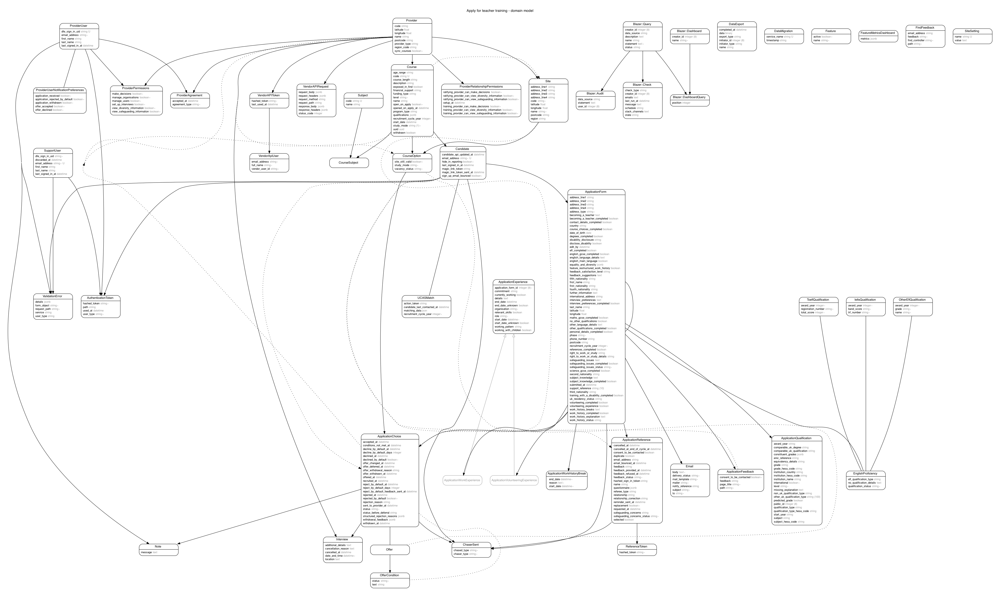

# Apply for postgraduate teacher training

This service enables postgraduate candidates to apply for initial teacher
training.

## Dependencies

- Ruby 2.6.3
- NodeJS 8.11.x
- Yarn 1.12.x
- PostgreSQL 9.6
- Graphviz 2.22+ (`brew install graphviz`) to generate the [domain model diagram](#domain-model)

## Prerequisites for development

`docker` and `docker-compose`

## Setting up the development environment

1. Copy `.env.example` to `.env` and fill in the secrets
1. Run `make setup`
1. Run `make serve` to launch the app on https://localhost:3000

See `Makefile` for the steps involved in building and running the app.

## Docker workflow

Under `docker-compose`, the database uses a Docker volume to persist
storage across `docker-compose up`s and `docker-compose down`s. For
want of cross-platform compatibility between JavaScript libraries, the
app's `node_modules` folder is also stored in a persistent Docker
volume.

Running `make setup` will blow away and recreate those volumes,
destroying any data you have created in development. It is necessary
to run it at least once before the app will boot in Docker.

## Webpacker

We do not use the Rails asset pipeline. We use the Rails webpack wrapper
[Webpacker](https://github.com/rails/webpacker) to compile our CSS, images, fonts
and JavaScript.

### Debugging Webpacker

Webpacker sometimes doesn't give clear indications of what's wrong when it
doesn't work.

**If you see repeated 'Webpacker compiling...' messages in the Rails server
log**, a good place to start debugging is by running the webpack compiler via
`bin/webpack`. This will give a much faster feedback loop than making requests
using a web browser.

**If you get `Webpacker::Manifest::MissingEntryError`s**, this usually points
to a problem in the compilation process which is causing one or more files not
to be created. Make sure that your yarn packages are up to date using `yarn
check` before proceeding to debug using `bin/webpack`.

**If assets work in dev but not in tests**, first confirm that you can compile
by invoking `bin/webpack`. If all is well, there is a chance that
`public/packs-test` contains stale output. Delete it and re-run the suite.

## Documentation

### Nomenclature

- **Course** consists of a UCAS provider code and a UCAS course code. In our system, this is represented by the `ucas_provider_code` and `ucas_course_code` on the `ApplicationChoice` model
- **Course Choice** is the course plus a training location code, in our system represented by `ucas_provider_code`, `ucas_course_code`, `ucas_location_code`

### Domain model

Regenerate this diagram with `bundle exec erd`.
